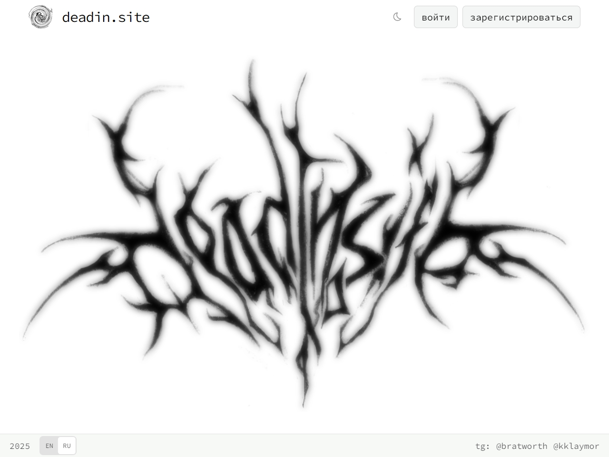
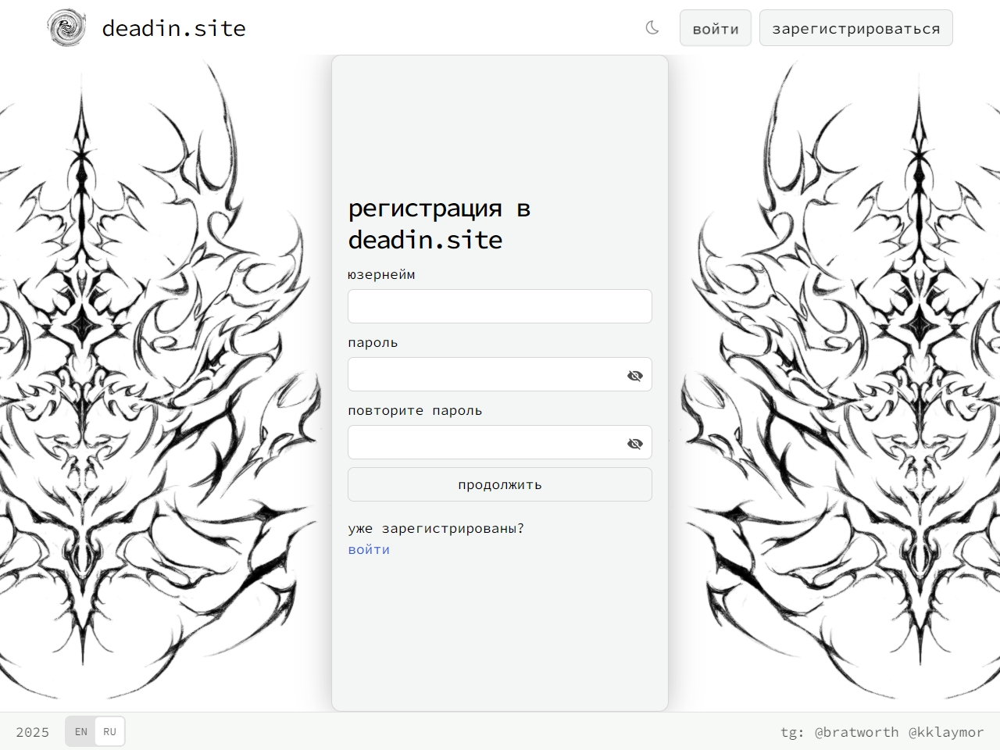
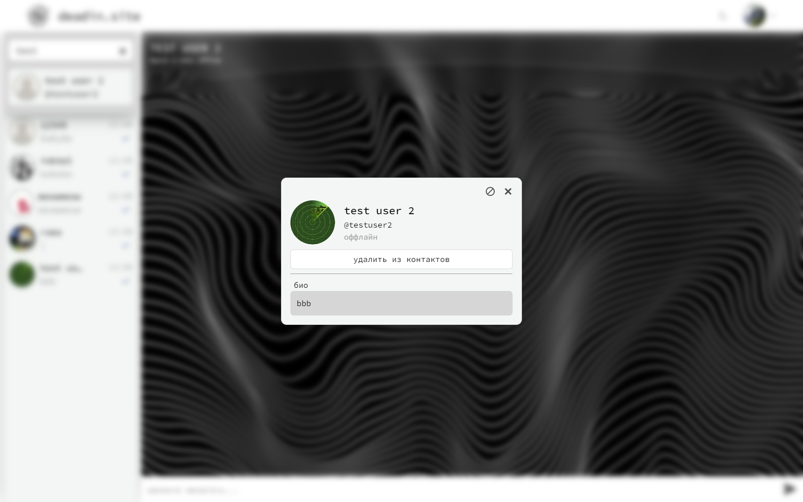
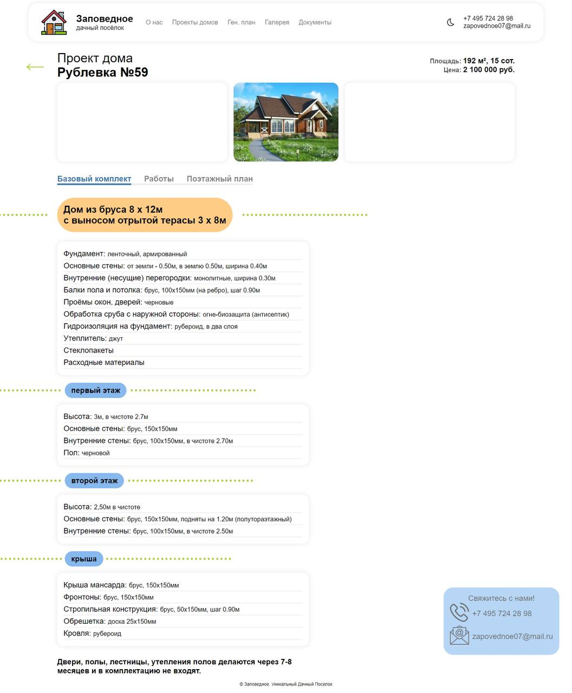
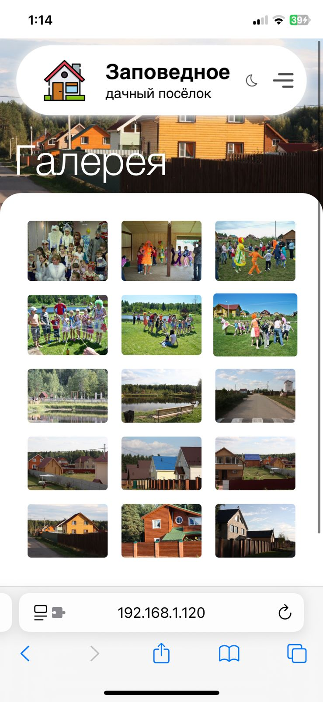
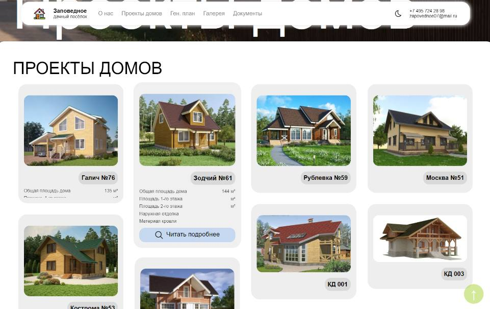

## привет, я Дина Комаеда 

- программист, выпускница СПО (Информационные системы и программирование, 2025)
- начинающий frontend-разработчик
- владею **HTML**, **CSS** (Sass, Bootstrap), BEM, FSD, **JavaScript**, **React** (JSX, Router, Framer Motion), Python

## мои проекты ! 

- [веб-мессенджер](https://github.com/2klaymor/web-messenger). дипломный проект. чат, авторизация, axios, socket.io
- https://deadinsite.vercel.app

  
  

  

- [веб-сайт для дачного посёлка](https://github.com/Kristina-112/Website_selo). учебная практика
- https://zapovednoe.vercel.app

  
  

    

